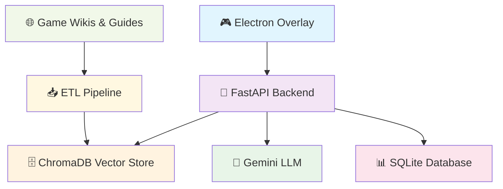

# 🎮 Pixly - AI Game Overlay

<div align="center">


**An intelligent game overlay that provides real-time contextual walkthroughs and tips while you play**

[](https://fastapi.tiangolo.com/)
[](https://www.electronjs.org/)
[](https://python.org/)
[](https://www.trychroma.com/)

[🚀 Quick Start](#-quick-start) • [📖 Documentation](#-documentation) • [🎯 Features](#-features) • [🛠️ Development](#️-development)

</div>

## ✨ Features

<table>
<tr>
<td width="50%">

### 🎯 **Smart Game Assistance**
- **Real-time Tips**: Contextual help while playing
- **AI-Powered RAG**: Intelligent tip generation
- **Multi-Game Support**: Minecraft, Elden Ring, Cyberpunk 2077, and more

</td>
<td width="50%">

### 🚀 **Developer Experience**
- **Transparent Overlay**: Non-intrusive gameplay experience
- **RESTful API**: Clean, well-documented endpoints
- **Smart ETL Pipeline**: Auto-ingests game guides and wikis

</td>
</tr>
</table>

<div align="center">

| 🎮 **Gaming** | 🤖 **AI-Powered** | 🛠️ **Developer-Friendly** |
|:---:|:---:|:---:|
| Real-time assistance | Vector database + LLMs | FastAPI + Electron |
| Multi-game support | Smart tip generation | Clean REST API |
| Transparent overlay | Auto ETL pipeline | Easy setup |

</div>

## 🏗️ Architecture

<div align="center">



**Pixly's intelligent architecture combines real-time game assistance with powerful AI**

</div>

## 🚀 Quick Start

<div align="center">

### ⚡ **Get Pixly running in under 5 minutes!**

</div>

### 📋 Prerequisites

<table>
<tr>
<td align="center" width="25%">

**🐍 Python 3.9+**
```bash
python --version
```

</td>
<td align="center" width="25%">

**📦 Node.js 16+**
```bash
node --version
```

</td>
<td align="center" width="25%">

**⚡ uv Package Manager**
```bash
pip install uv
```

</td>
<td align="center" width="25%">

**🔧 Git**
```bash
git --version
```

</td>
</tr>
</table>

### 🛠️ Installation

<details>
<summary><b>🪟 Windows Setup (Recommended)</b></summary>

<div align="center">

### 🚀 **One-Command Setup for Windows**

</div>

```cmd
# 1️⃣ Clone Pixly
git clone https://github.com/pixly/pixly.git
cd pixly

# 2️⃣ Run automated setup
setup-windows.bat
```

<div align="center">

**✨ The setup script automatically:**
- ✅ Installs all dependencies
- ✅ Creates environment files
- ✅ Initializes the database
- ✅ Runs sample data pipeline

</div>

```cmd
# 3️⃣ Add your API keys
# Edit .env file and add:
GEMINI_API_KEY=your_gemini_api_key_here
OPENAI_API_KEY=your_openai_api_key_here  # Optional

# 4️⃣ Start Pixly
start-dev.bat
```

<div align="center">

**🎮 Pixly is now running!**
- Backend: http://localhost:8000
- API Docs: http://localhost:8000/docs
- Overlay: Electron window

</div>

</details>

<details>
<summary><b>🐧 Linux/macOS Setup</b></summary>

<div align="center">

### 🚀 **One-Command Setup for Linux/macOS**

</div>

```bash
# 1️⃣ Clone Pixly
git clone https://github.com/pixly/pixly.git
cd pixly

# 2️⃣ Check system dependencies
make check-deps

# 3️⃣ Install uv if needed
make install-uv
# Restart shell: source ~/.bashrc

# 4️⃣ Run automated setup
make setup-linux
```

<div align="center">

**✨ The setup script automatically:**
- ✅ Installs Python dependencies with fallbacks
- ✅ Installs Electron dependencies
- ✅ Creates environment files
- ✅ Initializes the database
- ✅ Runs sample data pipeline

</div>

```bash
# 5️⃣ Add your API keys
# Edit .env file and add:
GEMINI_API_KEY=your_gemini_api_key_here
OPENAI_API_KEY=your_openai_api_key_here  # Optional

# 6️⃣ Start Pixly
# Option A: Manual (recommended)
make dev-backend    # Terminal 1
make dev-frontend   # Terminal 2

# Option B: Background services
make start-background
# View logs: tmux attach -t backend
# Stop: make stop-background
```

<div align="center">

**🎮 Pixly is now running!**
- Backend: http://localhost:8000
- API Docs: http://localhost:8000/docs
- Overlay: Electron window

</div>

</details>

## 🛠️ Development

<div align="center">

### 🚀 **Development Workflows**

</div>

<details>
<summary><b>🪟 Windows Development</b></summary>

<div align="center">

### **Easy Development with Batch Files**

</div>

```cmd
# 🚀 Start everything at once
start-dev.bat

# 🔧 Or start services separately
start-backend.bat    # Terminal 1
start-overlay.bat    # Terminal 2
```

<div align="center">

**📊 Development URLs:**
- Backend: http://localhost:8000
- API Docs: http://localhost:8000/docs
- ReDoc: http://localhost:8000/redoc

</div>

```cmd
# 🛠️ Manual development
uv run uvicorn src.main:app --host 127.0.0.1 --port 8000 --reload
cd static && npm run dev
```

</details>

<details>
<summary><b>🐧 Linux/macOS Development</b></summary>

<div align="center">

### **Flexible Development Options**

</div>

<table>
<tr>
<td width="33%">

**🎯 Manual Development**
```bash
# Terminal 1: Backend
make dev-backend

# Terminal 2: Frontend
make dev-frontend
```

</td>
<td width="33%">

**🚀 Background Services**
```bash
# Start both services
make start-background

# View logs
tmux attach -t backend
tmux attach -t frontend

# Stop services
make stop-background
```

</td>
<td width="33%">

**🔧 Individual Commands**
```bash
# Backend only
make dev

# Frontend only
make electron-dev

# Health check
make health
```

</td>
</tr>
</table>

<div align="center">

**📊 Development URLs:**
- Backend: http://localhost:8000
- API Docs: http://localhost:8000/docs
- ReDoc: http://localhost:8000/redoc

</div>

</details>

## 📖 API Usage

<div align="center">

### 🚀 **Pixly API - Smart Game Assistance**

</div>

<table>
<tr>
<td width="50%">

### 🎮 **Get Game Tips**

```bash
# Basic tips for Minecraft
curl "http://localhost:8000/api/v1/tips?game=minecraft"

# Search for specific tips
curl "http://localhost:8000/api/v1/tips?game=minecraft&query=redstone"

# Filter by category and difficulty
curl "http://localhost:8000/api/v1/tips?game=minecraft&category=beginner&difficulty=easy"
```

</td>
<td width="50%">

### ➕ **Create New Tips**

```bash
curl -X POST "http://localhost:8000/api/v1/tips" \
  -H "Content-Type: application/json" \
  -d '{
    "game_id": 1,
    "title": "Advanced Redstone Contraptions",
    "content": "Create complex redstone machines...",
    "category": "advanced",
    "difficulty": "hard"
  }'
```

</td>
</tr>
</table>

## 🧪 Testing

<div align="center">

### 🧪 **Comprehensive Testing Suite**

</div>

<table>
<tr>
<td width="50%">

### 🪟 **Windows Testing**

```cmd
# 🚀 Run all tests
test-windows.bat

# 🔧 Manual testing
uv run pytest tests/ -v --cov=src --cov-report=html
```

</td>
<td width="50%">

### 🐧 **Linux/macOS Testing**

```bash
# 🚀 Run all tests
make test

# 👀 Watch mode
make test-watch

# 🎯 Specific tests
uv run pytest tests/test_tips_api.py -v

# 🔍 Check dependencies
make check-deps
```

</td>
</tr>
</table>

## 🐳 Docker Deployment

<div align="center">

### 🚀 **Containerized Deployment**

</div>

<table>
<tr>
<td width="50%">

### 🛠️ **Development**

```bash
# 🚀 Build and run dev container
make docker-dev

# 📊 View logs
make docker-logs
```

</td>
<td width="50%">

### 🚀 **Production**

```bash
# 🏗️ Build production image
make docker-build

# 🚀 Run production container
make docker-run

# 🛑 Stop containers
make docker-stop
```

</td>
</tr>
</table>

## 📁 Project Structure

<div align="center">

### 🏗️ **Pixly Architecture Overview**

</div>

```
pixly/
├── 🎮 src/                    # Backend source code
│   ├── 🗄️ db/                # Database models and connections
│   ├── 📊 models/            # SQLAlchemy models
│   ├── 📋 schemas/           # Pydantic schemas
│   ├── 🔄 repositories/      # Data access layer
│   ├── ⚡ services/          # Business logic
│   │   ├── 🤖 rag_service.py     # RAG pipeline
│   │   ├── 📥 etl_service.py     # ETL operations
│   │   ├── 🧠 agent_service.py   # AI agent logic
│   │   └── 🎯 overlay_service.py # Overlay management
│   ├── 🛣️ routers/           # FastAPI routers
│   ├── 🔧 middlewares/       # Custom middleware
│   ├── ⚠️ exceptions/        # Custom exceptions
│   └── 🚀 main.py           # Application entry point
├── 🖥️ static/               # Electron frontend
│   ├── 🎨 index.html        # Overlay UI
│   ├── ⚡ main.js          # Electron main process
│   ├── 🔒 preload.js       # Preload script
│   └── 📦 package.json     # Node.js dependencies
├── 🧪 tests/               # Test suite
├── 📜 scripts/             # ETL and utility scripts
├── 📓 notebooks/           # Jupyter notebooks for experiments
├── ⚙️ pyproject.toml       # Python dependencies
├── 🐳 Dockerfile          # Docker configuration
├── 🐳 docker-compose.yml   # Docker Compose setup
├── 🛠️ Makefile           # Development commands
└── 📖 README.md          # This file
```

<div align="center">

**🎯 Clean, modular architecture for scalable game assistance**

</div>

## 🔧 Configuration

<div align="center">

### ⚙️ **Environment Configuration**

</div>

<table>
<tr>
<th>🔧 Variable</th>
<th>📝 Description</th>
<th>🎯 Default</th>
</tr>
<tr>
<td><code>HOST</code></td>
<td>Server host</td>
<td><code>127.0.0.1</code></td>
</tr>
<tr>
<td><code>PORT</code></td>
<td>Server port</td>
<td><code>8000</code></td>
</tr>
<tr>
<td><code>DEBUG</code></td>
<td>Debug mode</td>
<td><code>true</code></td>
</tr>
<tr>
<td><code>DATABASE_URL</code></td>
<td>Database connection</td>
<td><code>sqlite:///./pixly.db</code></td>
</tr>
<tr>
<td><code>GEMINI_API_KEY</code></td>
<td>Gemini API key</td>
<td><strong>Required</strong></td>
</tr>
<tr>
<td><code>CHROMA_PERSIST_DIRECTORY</code></td>
<td>Vector DB directory</td>
<td><code>./chroma_db</code></td>
</tr>
</table>

### 🔑 API Keys Setup

<div align="center">

### **Get your API keys to unlock Pixly's AI features**

</div>

<table>
<tr>
<td width="50%">

### 🤖 **Gemini API Key** (Required)

1. Visit [Google AI Studio](https://makersuite.google.com/app/apikey)
2. Create a new API key
3. Add to `.env`:
   ```bash
   GEMINI_API_KEY=your_gemini_key_here
   ```

</td>
<td width="50%">

### 🧠 **OpenAI API Key** (Optional)

1. Visit [OpenAI Platform](https://platform.openai.com/api-keys)
2. Create a new API key
3. Add to `.env`:
   ```bash
   OPENAI_API_KEY=your_openai_key_here
   ```

</td>
</tr>
</table>

## 🎯 Usage Examples

<div align="center">

### 🚀 **Pixly in Action - Real Examples**

</div>

<table>
<tr>
<td width="33%">

### 🎮 **Basic Game Tips**

```python
import requests

# Get tips for Minecraft
response = requests.get(
    "http://localhost:8000/api/v1/tips?game=minecraft"
)
tips = response.json()

for tip in tips["tips"]:
    print(f"Title: {tip['title']}")
    print(f"Content: {tip['content']}")
    print(f"Category: {tip['category']}")
    print("---")
```

</td>
<td width="33%">

### 📥 **ETL Pipeline**

```python
from src.services.etl_service import ETLService

# Initialize ETL service
etl = ETLService()

# Extract from URL
documents = etl.extract_from_url(
    "https://minecraft.fandom.com/wiki/Tutorials"
)

# Load into vector database
success = etl.load_to_vector_db(documents)
```

</td>
<td width="33%">

### 🤖 **RAG Pipeline**

```python
from src.services.rag_service import RAGService

# Initialize RAG service
rag = RAGService()

# Get contextual tips
tips = rag.get_tips_with_rag(
    query="How do I build a house?",
    game="minecraft",
    limit=5
)
```

</td>
</tr>
</table>

## 🛠️ Development

<div align="center">

### 🚀 **Advanced Development Features**

</div>

<details>
<summary><b>🐧 Linux-Specific Features</b></summary>

<div align="center">

### **Enhanced Linux Development Experience**

</div>

```bash
# 🔍 Check system dependencies
make check-deps

# ⚡ Install uv package manager
make install-uv

# 🚀 Start services in background with tmux
make start-background

# 🛑 Stop background services
make stop-background

# 📖 View help for all available commands
make help
```

</details>

### 🎨 Code Quality

<table>
<tr>
<td width="50%">

### 🪟 **Windows Code Quality**

```cmd
# 🎨 Format code
uv run black src/ tests/
uv run isort src/ tests/

# 🔍 Run linting
uv run flake8 src/ tests/
uv run mypy src/
```

</td>
<td width="50%">

### 🐧 **Linux/macOS Code Quality**

```bash
# 🎨 Format code
make format

# 🔍 Run linting
make lint

# 🧹 Clean up files
make clean

# 🔍 Check dependencies
make check-deps
```

</td>
</tr>
</table>

### 🗄️ Database Migrations

<table>
<tr>
<td width="50%">

### 🪟 **Windows Migrations**

```cmd
# 📝 Create migration
uv run alembic revision --autogenerate -m "Add new table"

# 🚀 Apply migrations
uv run alembic upgrade head
```

</td>
<td width="50%">

### 🐧 **Linux/macOS Migrations**

```bash
# 📝 Create migration
uv run alembic revision --autogenerate -m "Add new table"

# 🚀 Apply migrations
make db-migrate

# 🗄️ Initialize database
make db-init
```

</td>
</tr>
</table>

### 🎮 Adding New Games

<div align="center">

### **Expand Pixly's Game Support**

</div>

<table>
<tr>
<td width="33%">

### 1️⃣ **Create Game Data**

```python
from src.repositories.tip_repository import TipRepository

# Add new game
game = tip_repo.get_or_create_game("new_game")
```

</td>
<td width="33%">

### 2️⃣ **Run ETL Pipeline**

```bash
# 🐧 Linux/macOS
make etl-sample

# 🪟 Windows
uv run python scripts/etl_sample_data.py
```

</td>
<td width="33%">

### 3️⃣ **Test Retrieval**

```bash
# 🐧 Linux/macOS
curl "http://localhost:8000/api/v1/tips?game=new_game"

# 🪟 Windows (PowerShell)
Invoke-RestMethod "http://localhost:8000/api/v1/tips?game=new_game"
```

</td>
</tr>
</table>

## 🤝 Contributing

<div align="center">

### 🚀 **Join the Pixly Community!**

</div>

<table>
<tr>
<td width="50%">

### 🎯 **Quick Start**

1. **Fork** the repository
2. **Create** feature branch:
   ```bash
   git checkout -b feature/amazing-feature
   ```
3. **Make** your changes and add tests
4. **Run** test suite: `make test`
5. **Commit** changes:
   ```bash
   git commit -m 'Add amazing feature'
   ```
6. **Push** to branch:
   ```bash
   git push origin feature/amazing-feature
   ```
7. **Open** a Pull Request

</td>
<td width="50%">

### 📋 **Development Guidelines**

- ✅ Follow PEP 8 style guidelines
- ✅ Write comprehensive tests
- ✅ Update documentation
- ✅ Use type hints
- ✅ Write clear commit messages
- ✅ Test on both Windows and Linux

</td>
</tr>
</table>

## 📝 License

<div align="center">

### 📄 **MIT License**

This project is licensed under the MIT License - see the [LICENSE](LICENSE) file for details.

</div>

## 🙏 Acknowledgments

<div align="center">

### 🚀 **Built with Amazing Open Source Tools**

</div>

<table>
<tr>
<td align="center" width="25%">

**[FastAPI](https://fastapi.tiangolo.com/)**
<br>⚡ Lightning-fast web framework

</td>
<td align="center" width="25%">

**[ChromaDB](https://www.trychroma.com/)**
<br>🗄️ Vector database capabilities

</td>
<td align="center" width="25%">

**[Electron](https://www.electronjs.org/)**
<br>🖥️ Cross-platform desktop apps

</td>
<td align="center" width="25%">

**[Google Gemini](https://ai.google.dev/)**
<br>🤖 Advanced LLM capabilities

</td>
</tr>
</table>

## 📞 Support

<div align="center">

### 🆘 **Get Help & Connect**

</div>

<table>
<tr>
<td align="center" width="33%">

**📧 Email Support**
<br>support@pixly.ai

</td>
<td align="center" width="33%">

**🐛 Report Issues**
<br>[GitHub Issues](https://github.com/pixly/pixly/issues)

</td>
<td align="center" width="33%">

**💬 Community**
<br>[GitHub Discussions](https://github.com/pixly/pixly/discussions)

</td>
</tr>
</table>

<div align="center">

---

## 🎮 **Happy Gaming with Pixly!** ✨

**Transform your gaming experience with AI-powered assistance**

[](https://github.com/pixly/pixly)
[](https://github.com/pixly/pixly/fork)
[](https://github.com/pixly/pixly)

</div>
